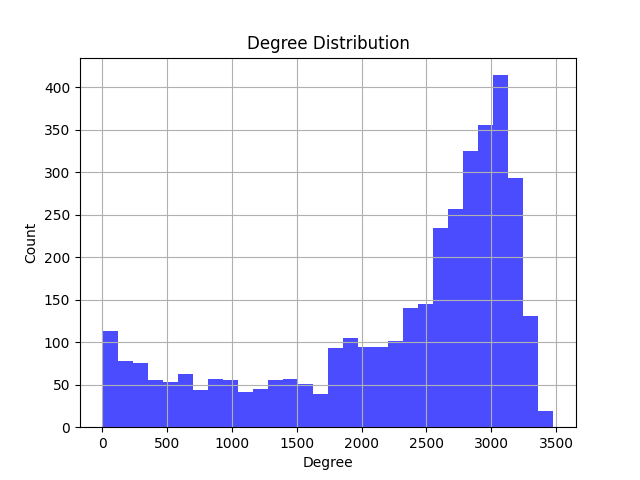
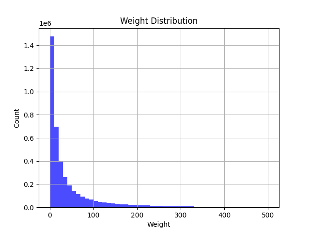
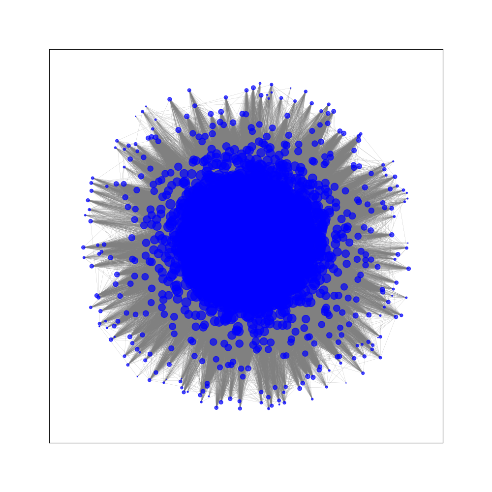
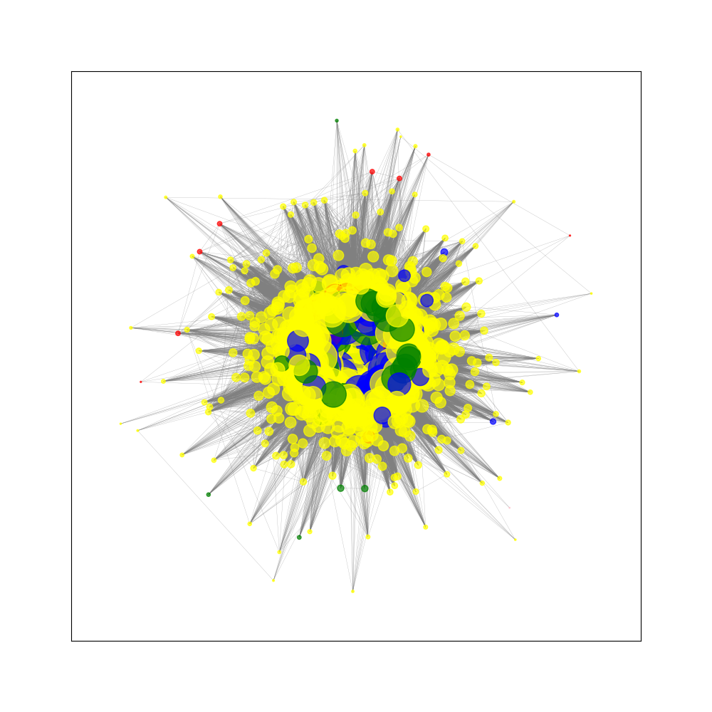

Using Community Detection​ to predict the asscociations between products on an e-commerce platform​
===

使用社群偵測（Community Detection）方法，針對單一商品推薦其他有相關性的10個商品。

Dataset
---

使用的資料集來源自Kaggle的[Online retail dataset​](<https://www.kaggle.com/datasets/lakshmi25npathi/online-retail-dataset?resource=download>)

這個Online Retail 資料集包含了一個位於英國的網路零售公司在2009年12月1日至2011年12月9日期間的所有交易記錄。

Method
---

首先，我們移除 ‘CustomerID’ 欄位為空的資料。​

接著，我們使用networkx函式庫建立無向圖 G，我們將使用資料集中的所有商品作為節點。​

對於那些被同一位客戶購買的兩個商品，我們在圖中添加一條邊來表示它們之間的關聯。如果兩個商品已經有邊存在，則我們將增加那條邊的權重。 接著我們對每個商品找出權重最重的前五個商品，作為其推薦商品。

---

剩餘的五個商品我們使用Louvain演算法，它是一種常用的社群偵測算法，用於識別複雜網絡中的社群結構。該算法旨在將網絡劃分為多個社群，最大化各社群內的Modularity score。

使用Louvain演算法對將每個商品進行分群。​
接著，對每個社群計算社群內的每個節點的中心度，並取該社群中心度最高的五樣商品作為推薦商品。

Experiment
---

* 分支度分布圖

* 邊權重分布圖

* 中心度展示圖

Conclusion
---

* 對單一商品使用邊權重方法，透過計算邊的權重，我們能夠量化商品之間的關聯性。根據該權重，我們可以找到與特定商品最相關的五個商品。​

* 對於分群後的網絡圖，我們進一步運用了中心度方法來找出每個社群中最具代表性的五個商品。通過計算節點的中心度，我們能夠評估商品在社群內的重要程度。根據這些中心度值，我們選擇了每個社群中最具代表性的五個商品，這些商品可以視為該社群的代表。​

* 總結而言，透過這兩種方法方法，我們可以在單一商品和分群層面上，提供關聯性和代表性的商品推薦，從而增強營銷和銷售策略的效果。

